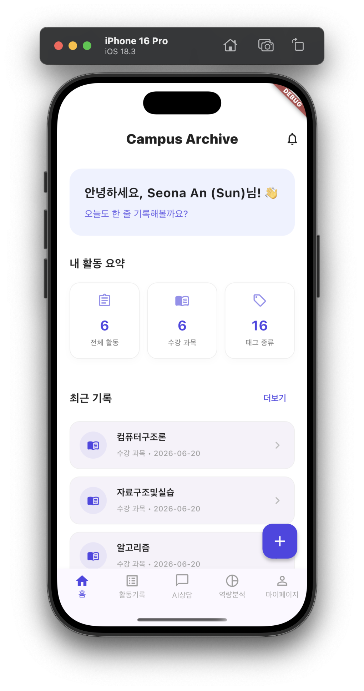
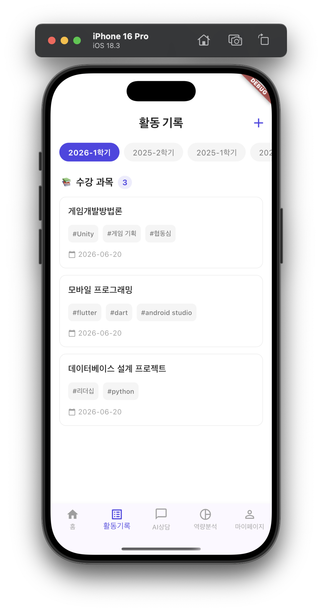
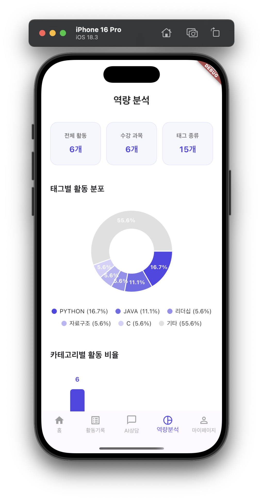
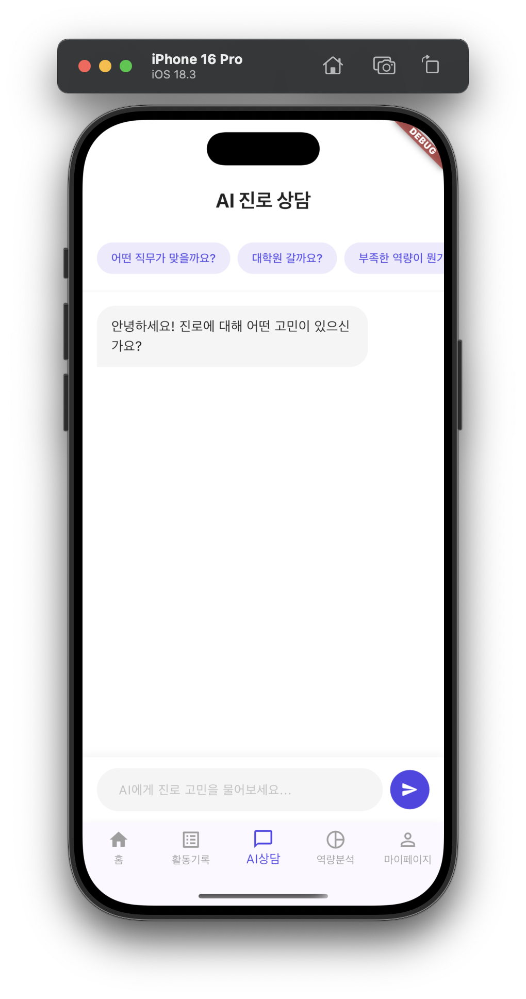
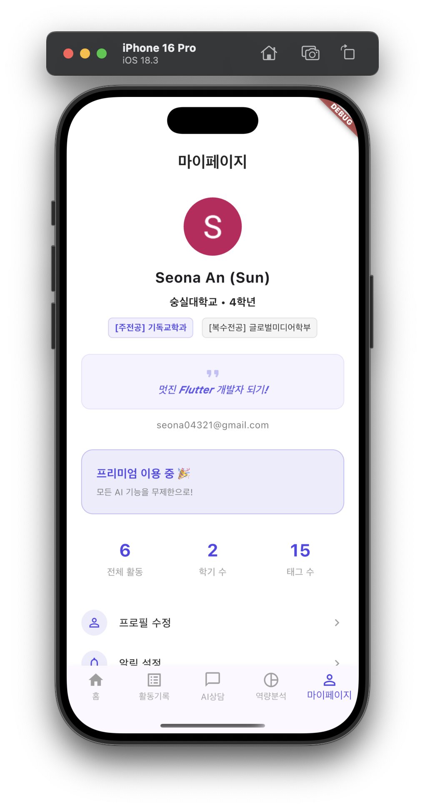

# 🧭 Campus Archive

> **나를 알면 길이 보인다** — 대학생활 기록부터 AI 진로 상담까지

---

## 📱 프로젝트 개요

**Campus Archive**는 흩어져 있는 대학생의 학업·활동 이력을 한 곳에 기록하고, 이를 기반으로 AI가 역량을 분석해 진로 방향을 제시하는 앱입니다.

수강 과목, 교내 활동, 대외 활동 등 졸업 시점까지 쌓이는 경험들을 체계적으로 정리하지 못하는 문제에서 출발했습니다. 단순 기록을 넘어 "내가 어떤 사람인지"를 데이터로 확인하고, 진로 고민에 실질적인 답을 얻을 수 있도록 기획했습니다.

### 기획 배경
- 대학생활 동안 쌓이는 활동·과제·대외활동 기록이 여러 곳에 흩어져 졸업 시점에 정리가 안 됨
- 취업 준비 시 "나에게 맞는 직무가 뭔지" 막막함을 겪는 4학년의 실제 고민에서 출발
- 단순 기록 도구를 넘어, 기록이 쌓일수록 분석이 정교해지는 구조 설계

---

## ✨ 주요 기능

### 무료 기능
- **활동 기록**: 학기별 수강 과목 / 교내 활동 / 대외 활동 기록, 수정, 삭제
- **태그 시스템**: 활동마다 역량 태그(#기획, #리더십, #데이터분석 등) 부여
- **역량 분석 차트**: 태그별 활동 분포(도넛 차트), 카테고리별 비율(막대 차트) 시각화
- **마이페이지**: 프로필, 활동 요약, 구독 플랜 관리

### 프리미엄 기능 (월 4,900원 / 연 53,900원)
- **AI 진로 상담**: 내 활동 데이터를 기반으로 한 1:1 채팅 상담
- **AI 직무 추천**: 태그 분석 기반 적합 직무 추천 및 부족한 역량 안내

---

## 🛠 기술 스택

| 항목 | 내용 |
|------|------|
| Framework | Flutter |
| Language | Dart |
| 인증 | Firebase Authentication (Google 로그인) |
| 데이터베이스 | Cloud Firestore |
| 차트 | fl_chart |
| 로컬 저장 | shared_preferences (구독 상태 관리) |
| 상태관리 | setState |

---

## 📂 화면 구성

| 화면 | 설명 |
|------|------|
| 온보딩/로그인 | 자동 로그인 체크 → Google 로그인 |
| 홈 | 활동 요약, 최근 기록, 빠른 기록 추가 |
| 활동 기록 | 학기별·카테고리별 활동 목록, 등록/수정/삭제 |
| 역량 분석 | 태그·카테고리 기반 차트 시각화, AI 직무 추천 진입 |
| AI 진로 상담 | 활동 데이터 기반 채팅형 상담 (프리미엄) |
| AI 직무 추천 | 적합 직무 추천 카드 (프리미엄) |
| 마이페이지 | 프로필, 구독 플랜, 활동 요약, 설정 |

---

## 💰 수익 모델 (Freemium)

| 플랜 | 가격 | 제공 기능 |
|------|------|-----------|
| 무료 | 0원 | 활동 기록, 학기 관리, 태그, 역량 차트 |
| 월 구독 | 4,900원/월 | 무료 기능 + AI 진로 상담, AI 직무 추천 |
| 연 구독 | 53,900원/년 | 월 구독 전체 (약 8% 할인) |

기록 자체만으로도 충분한 가치를 제공하되, AI 기반 심화 분석은 구독자에게 제공하는 구조로 설계했습니다.

---

## 🙋 본인이 구현한 부분

- 전체 화면 기획 및 UI/UX 설계
- 앱 브랜딩 (컬러 시스템, 로고, 슬로건, 아이콘, 스플래시 스크린)
- Firebase Authentication 연동 (Google 로그인, 자동 로그인 체크)
- Firestore 기반 활동 기록 CRUD (등록/조회/수정/삭제)
- 학기별·카테고리별 필터링 및 태그 시스템
- fl_chart를 활용한 역량 분석 시각화 (도넛 차트, 막대 차트)
- Freemium 구독 모델 설계 및 구독 상태 기반 기능 분기 UI
- AI 진로 상담 / AI 직무 추천 화면 (Firestore 데이터 연동 더미 응답)

---

## 🤖 AI 활용 여부 및 활용 범위

본 프로젝트는 **바이브 코딩(Vibe Coding)** 방식을 적극 활용하였습니다.

| 활용 도구 | 활용 내용 |
|-----------|-----------|
| Claude (Anthropic) | 앱 기획, MVP 범위 설정, 수익 모델 설계, 브랜딩 방향 결정 |
| Claude / Gemini | 화면별 Flutter 코드 생성 (프롬프트 기반) |
| Gemini | Firebase 연동 설정 과정 보조 |

- 화면별로 상세한 프롬프트를 직접 작성하여 코드 생성
- 생성된 코드를 검토·수정하며 앱에 통합
- 기획 의도, 브랜딩 컨셉, 수익 모델, MVP 우선순위는 직접 설계

### AI 기능 관련 안내
현재 AI 진로 상담 및 직무 추천 기능은 **Firestore에 저장된 실제 사용자 활동 데이터를 기반으로 한 더미(rule-based) 응답**으로 구현되어 있습니다. 실제 LLM API(Claude/Gemini) 연동 구조는 설계가 완료된 상태이며, 실 배포 시 연결할 예정입니다.

```dart
// TODO: 실제 배포 시 Claude/Gemini API 연동 예정
// 현재는 Firestore 데이터 기반 더미 응답으로 시연
```

---

## 📄 라이선스

```
MIT License

Copyright (c) 2026

Permission is hereby granted, free of charge, to any person obtaining a copy
of this software and associated documentation files (the "Software"), to deal
in the Software without restriction, including without limitation the rights
to use, copy, modify, merge, publish, distribute, sublicense, and/or sell
copies of the Software, and to permit persons to whom the Software is
furnished to do so, subject to the following conditions:

The above copyright notice and this permission notice shall be included in
all copies or substantial portions of the Software.

THE SOFTWARE IS PROVIDED "AS IS", WITHOUT WARRANTY OF ANY KIND, EXPRESS OR
IMPLIED, INCLUDING BUT NOT LIMITED TO THE WARRANTIES OF MERCHANTABILITY,
FITNESS FOR A PARTICULAR PURPOSE AND NONINFRINGEMENT.
```

---

## 📸 실행 화면

| 홈 | 활동 기록 | 역량 분석 |
|------|------|------|
|  |  |  |

| AI 상담 | 마이페이지 |
|------|------|
|  |  |

---

*Campus Archive — 나를 알면 길이 보인다* 🧭